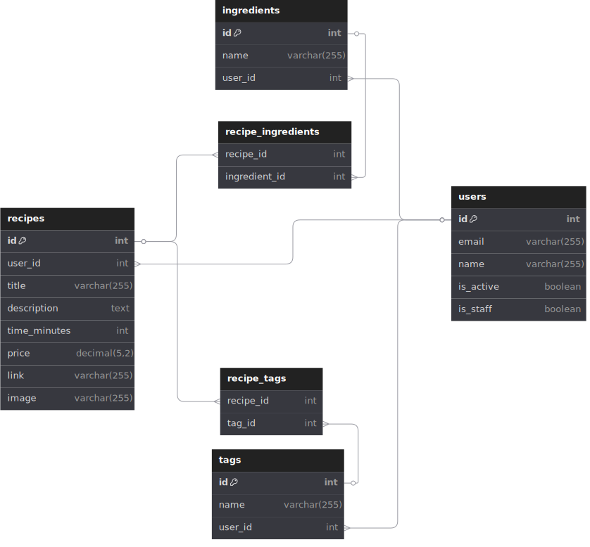
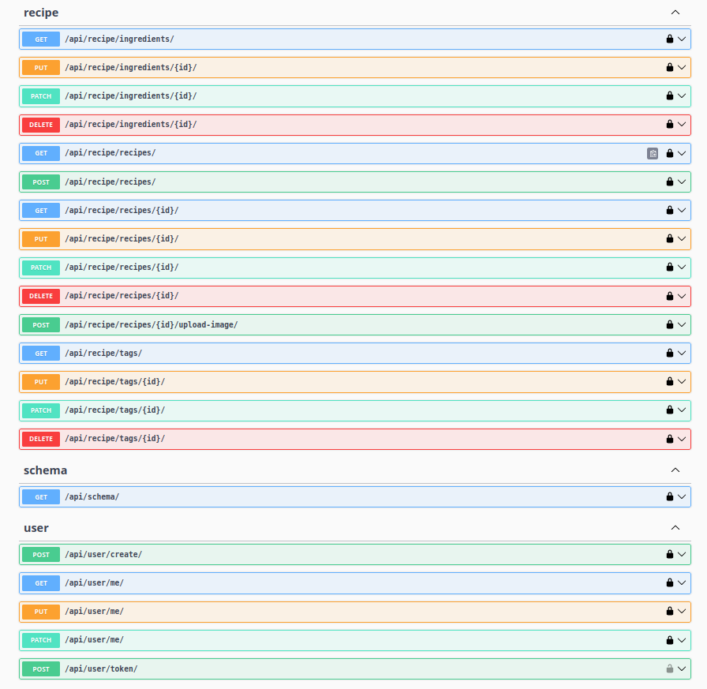

# DRF Recipes Practice API

[](https://codecov.io/gh/MihaiAC/drf-recipes-practice-api)

A REST API built with Django Rest Framework, designed to simulate the backend needs of a recipe-saving app. The project’s main goal was to gain hands-on experience with DRF, apply TDD principles, and learn how to Dockerize a Django application.

## Key Features

- JWT authentication
- Fully-tested using Test-Driven Development (TDD)
- CI with GitHub Actions
- Dockerized setup with uWSGI and Nginx for deployment
- PostgreSQL as the database
- API schema generated with drf-spectacular
- Implicit documentation with docstrings
- Code coverage uploaded to Codecov

## Database Schema



Each recipe can have multiple tags and ingredients.

`(ingredient_name, user_id)` and `(tag_name, user_id)` act as unique constraints in their respective tables.

## API Schema



Typical Workflow:

1. Create a user via a `POST` request to `/api/user/create`
2. Obtain a JWT with a `POST` request to `/api/user/token`
3. Include the token in future request headers (format: `"Token insert_token_here"`)
4. Add recipes, which can optionally include tags, ingredients and an image.

CRUD operations can then be performed on recipes, tags, and ingredients.

## Running Locally

After cloning the repo, create a `.env` file in the project root and include the necessary variables from `.env.sample`.

Then, run:

```
docker compose up -d
```

## Running Tests

To run the tests locally, use the following command:

```
docker compose exec app python manage.py test
```

## References

This project is based on this [course](https://www.udemy.com/course/django-python-advanced/).
